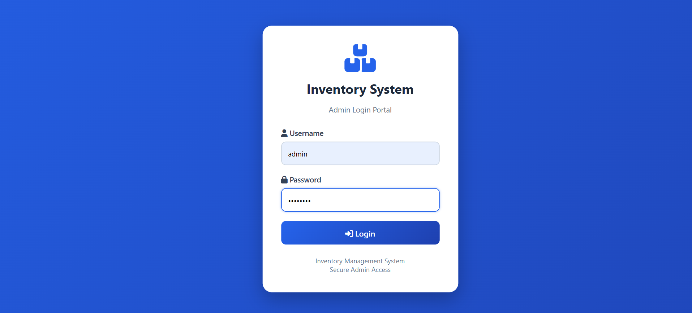
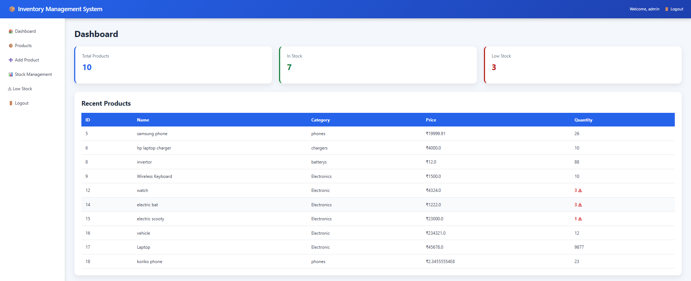
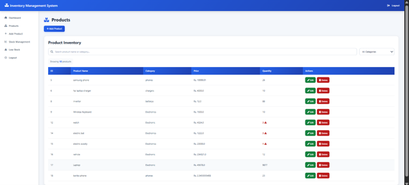
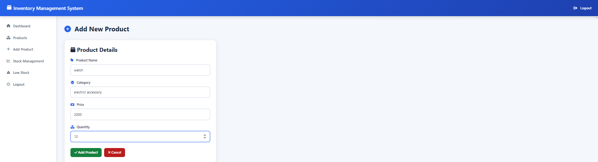
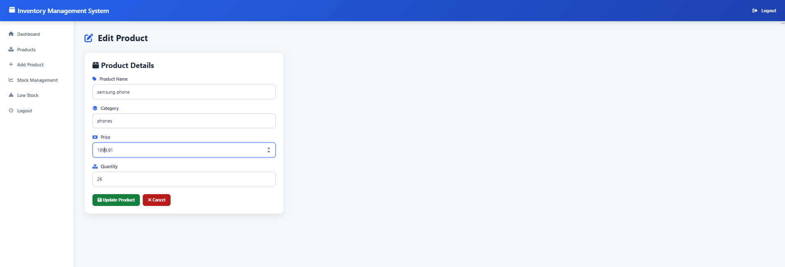
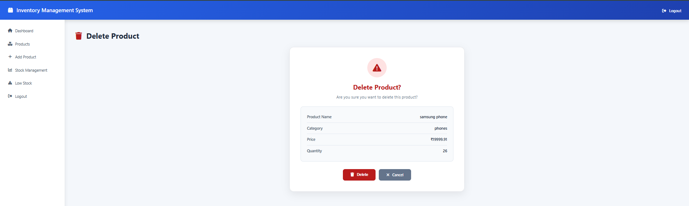
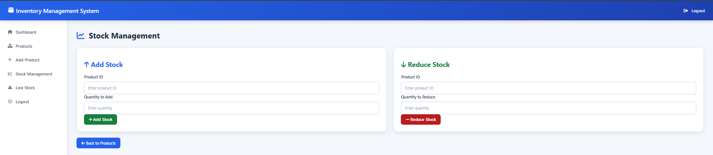
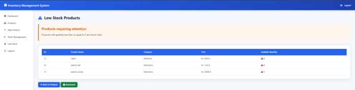
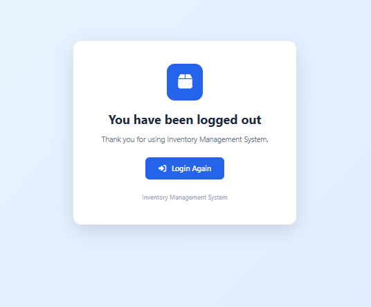

# 📦 Inventory Management System

A Java-based **Inventory Management System Web Application** developed using **Java Servlets, JSP, JDBC, and MySQL**.

This application helps manage inventory efficiently by providing features like product management, stock tracking, searching, filtering, and low stock monitoring.

---

# 🚀 Features

## 🔐 User Authentication
- User login functionality
- Session-based authentication
- Secure logout option

---

## 📊 Dashboard
- Displays total number of products
- Shows available stock quantity
- Displays low stock items
- Shows recently added products

---

## 📦 Product Management
- Add new products
- View all products
- Edit product details
- Delete products with confirmation
- Search products
- Filter products by category

---

## 📈 Stock Management
- Add stock quantity
- Reduce stock quantity
- Maintain available inventory levels

---

## ⚠️ Low Stock Management
- Automatically identifies products with low quantity
- Displays products requiring restocking

---

# 🛠️ Technologies Used

| Technology | Purpose |
|------------|---------|
| Java | Backend Programming |
| Java Servlets | Request Handling |
| JSP | Dynamic Web Pages |
| JDBC | Database Connectivity |
| MySQL | Database Management |
| HTML5 | Web Structure |
| CSS3 | Styling |
| Font Awesome | Icons |
| Apache Tomcat | Application Server |
| Eclipse IDE | Development Environment |

---

# 📂 Project Structure

```
InventoryManagementWeb
│
├── src/main/java
│
│   ├── com.inventory.web
│   │
│   │   ├── AddProductServlet.java
│   │   ├── AddStockServlet.java
│   │   ├── AuthFilter.java
│   │   ├── DashboardServlet.java
│   │   ├── DeleteProductServlet.java
│   │   ├── EditProductServlet.java
│   │   ├── LoginServlet.java
│   │   ├── LogoutServlet.java
│   │   ├── LowStockServlet.java
│   │   ├── ProductServlet.java
│   │   ├── ReduceStockServlet.java
│   │   └── SearchProductServlet.java
│   │
│   └── com.inventoryy
│       │
│       ├── DBConnection.java
│       ├── Product.java
│       ├── ProductDAO.java
│       └── UserDAO.java
│
│
└── src/main/webapp
    │
    ├── css
    │   └── style.css
    │
    ├── dashboard.jsp
    ├── products.jsp
    ├── add-product.jsp
    ├── edit-product.jsp
    ├── delete-confirm.jsp
    ├── delete-product.jsp
    ├── low-stock.jsp
    ├── logout.jsp
    │
    └── WEB-INF
        │
        ├── web.xml
        └── lib
            └── mysql-connector-j-9.7.0.jar
```

---

# 🗄️ Database Configuration

The project uses **MySQL Database**.

## Database Name

```
inventory_db
```

---

## Tables

### Product Table

Stores product information:

- Product ID
- Product Name
- Category
- Price
- Quantity

---

### User Table

Stores login information:

- Username
- Password

---

# ⚙️ How to Run the Project

## 1. Clone Repository

```bash
git clone https://github.com/RupaSriSowmya/InventoryManagementWeb.git
```

---

## 2. Import Project

1. Open **Eclipse IDE**
2. Import the project as a Dynamic Web Project
3. Configure Apache Tomcat Server
4. Build the project

---

## 3. Configure MySQL Database

1. Install MySQL Server

2. Create database:

```sql
CREATE DATABASE inventory_db;
```

3. Create required tables.

4. Update database credentials in:

```
DBConnection.java
```

Example:

```java
Connection con = DriverManager.getConnection(
"jdbc:mysql://localhost:3306/inventory_db",
"username",
"password"
);
```

---

## 4. Add MySQL Connector

Add MySQL JDBC Driver:

```
mysql-connector-j-9.7.0.jar
```

inside:

```
src/main/webapp/WEB-INF/lib
```

---

## 5. Run Application

1. Start Apache Tomcat Server.

2. Open browser:

```
http://localhost:8081/InventoryManagementWeb/
```

---

# 📸 Application Screenshots

## 🔐 Login Page




## 📊 Dashboard




## 📦 Product Management




## ➕ Add Product




## ✏️ Edit Product




## 🗑️ Delete Confirmation


## 🚪 stock management Page



## 🚪 Low stock Page


## 🚪 Logout Page



---

# 👩‍💻 Author

**Velagala Rupa Sri Sowmya**

GitHub:
https://github.com/RupaSriSowmya

LinkedIn:
https://www.linkedin.com/in/velagala-rupa-sri-sowmya326839291 
---

# ⭐ Project Highlights

- MVC-based architecture using Servlets and JSP
- DAO pattern for database operations
- Session-based authentication
- CRUD operations using JDBC
- Responsive UI with CSS styling
- Real-time inventory tracking
